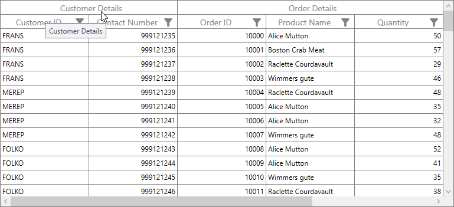

# How to show tooltip for Stacked Headers in WPF DataGrid (SfDataGrid)?

# About the sample

This example illustrates how to show tooltip for Stacked Headers in WPF DataGrid (SfDataGrid).

[WPF DataGrid](https://www.syncfusion.com/wpf-ui-controls/datagrid) (SfDataGrid) doesn’t have direct support to show tooltip for the stacked header cell. However you can enable tooltip for the stacked header cells by including Style with TargetType as GridStackedHeaderCellControl. 

```XAML

<Window.Resources>
    <Style TargetType="syncfusion:GridStackedHeaderCellControl">
        <Setter Property="ToolTip">
            <Setter.Value>
                <TextBlock Text="{Binding HeaderText}" ToolTipService.IsEnabled="True" 
                            ToolTipService.ShowOnDisabled="True"/>
            </Setter.Value>
        </Setter>
        <Setter Property="ToolTipService.IsEnabled" Value="True" />
        <Setter Property="ToolTipService.ShowOnDisabled" Value="True" />
    </Style>
</Window.Resources>

<Grid>
    <syncfusion:SfDataGrid Name="dataGrid"
                           AllowFiltering="True"
                           ItemsSource="{Binding OrdersListDetails}">
        <syncfusion:SfDataGrid.StackedHeaderRows>
            <syncfusion:StackedHeaderRow>
                <syncfusion:StackedHeaderRow.StackedColumns>
                    <syncfusion:StackedColumn ChildColumns="OrderID,ProductName,Quantity" HeaderText="Order Details" MappingName="OrderDetails"/>
                    <syncfusion:StackedColumn ChildColumns="CustomerID,ContactNumber" HeaderText="Customer Details" MappingName="CustomerDetails"/>
                </syncfusion:StackedHeaderRow.StackedColumns>
            </syncfusion:StackedHeaderRow>
        </syncfusion:SfDataGrid.StackedHeaderRows>
    </syncfusion:SfDataGrid>

```




## Requirements to run the demo

Visual Studio 2015 and above versions.
